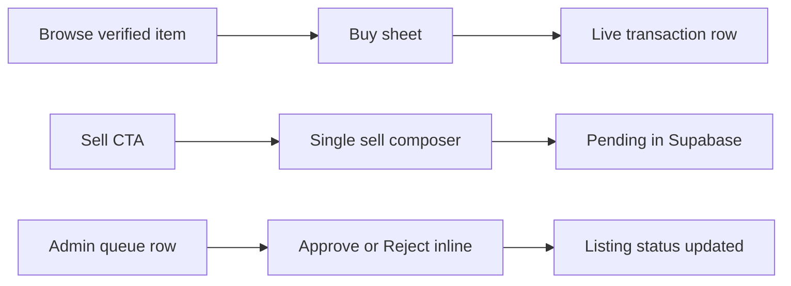

# Interaction Principles — Fewer Clicks, More Done

Zyra’s UX goal: teens complete sell / buy / donate / claim with **minimal navigation**. Prefer compose + sheets over wizards and extra pages.

## Rules

1. **Compose, don’t wizard**  
   Sell and donate are **one scrolling screen** with a sticky Submit. Details + required photo slots + price (marketplace) live together. No separate “review” step unless validation fails inline.

2. **Auth at the moment of need**  
   Guests can browse Market and Donate. Sign up / log in opens as a **Sheet** only when they tap Sell, Buy, or Claim.

3. **Inline sheets over new routes**  
   - **Buy** = Sheet on item detail (method + meetup + price breakdown + Confirm)  
   - **Claim** = Sheet on donation detail  
   Confirm writes **live** Supabase rows (and Stripe Checkout redirect only for online pay).

4. **Onboarding in one pass**  
   Signup collects display name, credentials, 13+ confirmation, area, and optional first meetup. Skipping meetup is allowed; COD later triggers inline quick-add.

5. **Unified Activity**  
   One inbox from live queries: my listings, buys, claims. Each row shows status + one primary action. No separate teen “My listings” vs “My transactions” tabs as separate destinations.

6. **Admin speed**  
   Verification queue shows photo strip + Approve / Reject **inline** (reject reason via AlertDialog). Avoid forcing a full detail page for the happy path. Transactions use a filterable DataTable.

7. **Smart defaults**  
   - Prefill meetup from profile  
   - Fee calculated server-side  
   - Photo angle checklist with per-slot capture  
   - Remember `preferred_payment` on profile  

## Click-count targets

| Task | Target |
| --- | --- |
| Submit marketplace listing (after fields/photos filled) | **1** primary tap (Submit) |
| Buy COD from open verified item (logged in, meetup saved) | **≤ 2** taps (open sheet if needed → Confirm) |
| Admin verify from queue | **1** tap (Approve) |
| Claim donation (logged in) | **1** primary tap after short form in sheet |

## Anti-patterns (do not ship)

- Multi-step sell wizard (details → photos → review → done) as separate routes  
- Checkout as a full page when a Sheet suffices  
- Role “switcher” that invents client-only fake data (use real seeded admin account)  
- Pending items in public Market browse  

## Flow sketch

