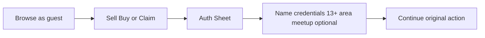
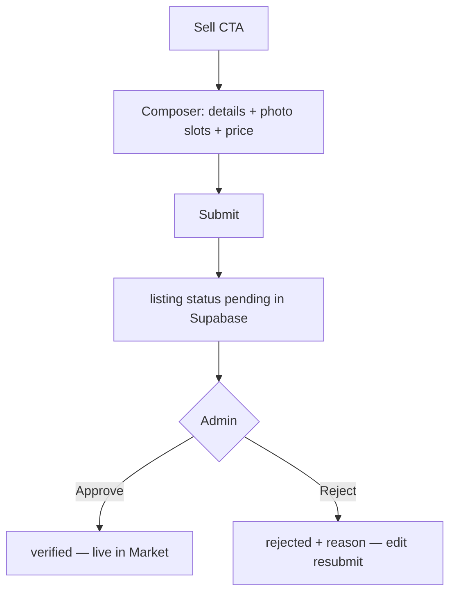
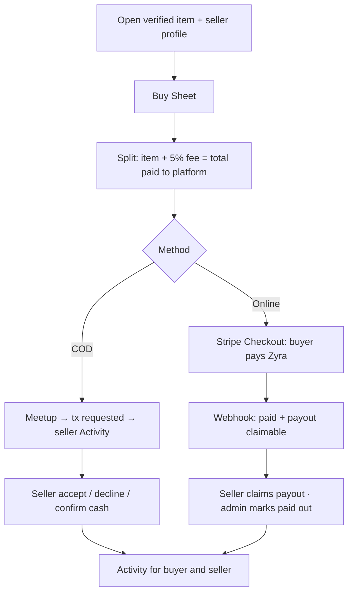
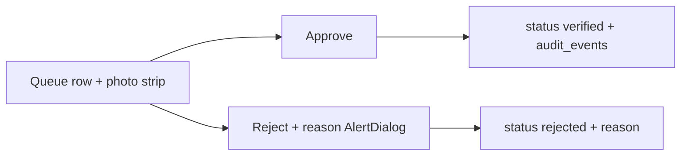

# User Flows

Happy paths for the live-data MVP. Designed for **fewer clicks** — see [interaction-principles.md](../drawing-board/interaction-principles.md).

---

## A. Sign up (one pass)

**Steps**

1. Guest browses freely.  
2. Protected action opens Auth Sheet.  
3. Sign up: display name, email, password, **13+** checkbox, short under-16 parental note, area, optional first meetup.  
4. `profiles` + optional `meetup_points` written to Supabase; continue the interrupted action.

**Edge:** Skip meetup → allowed; COD later opens inline quick-add.

---

## B. Sell (single composer → pending)

**Photo angles (required):** Front, Back, Tag, Defect — each slot uploads to Supabase Storage + `listing_photos`.

**Seller sees:** Pending badge in Activity; not visible in public Market.

**Click target:** one Submit after fill.

---

## C. Buy (Sheet on detail)

**Price breakdown (always):** item · platform fee (default 5%) · **total paid to Zyra** · **seller receives** · method.

**Routing:** every buy creates a `transactions` row with `seller_id` = listing owner; seller sees it under Activity → Selling / Buys inbox.

**Click target:** ≤2 taps when logged in with meetup saved.

See [marketplace-payment-model.md](../research/marketplace-payment-model.md).

---

## D. Donate / claim

**List donation:** same single-composer pattern; `price_cents` null; enters **pending** verification (same queue).

**Claim:** Sheet on detail — message, contact, pickup preference, org self-describe if needed → `donation_claims` row. Donor approves/declines from Activity.

---

## E. Admin verify (inline)

**Click target:** Approve = 1 tap from queue.

---

## Facilitator script map

| Research task | Flow |
| --- | --- |
| T1 Account + meetup | A |
| T2 List item + photos | B |
| T3 Admin verify | E |
| T4 Buy COD + explain total | C |
| T5 Donate or claim | D |
