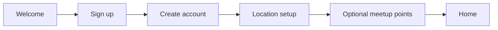
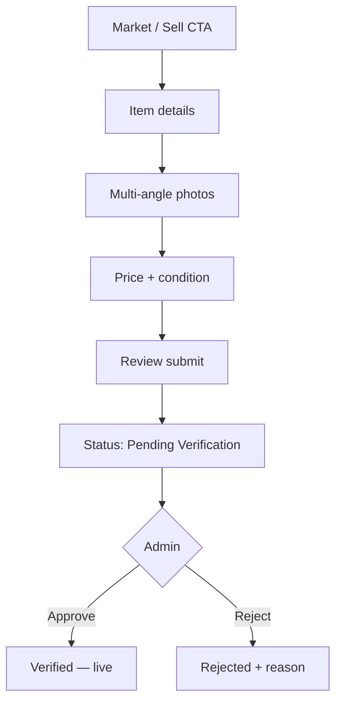
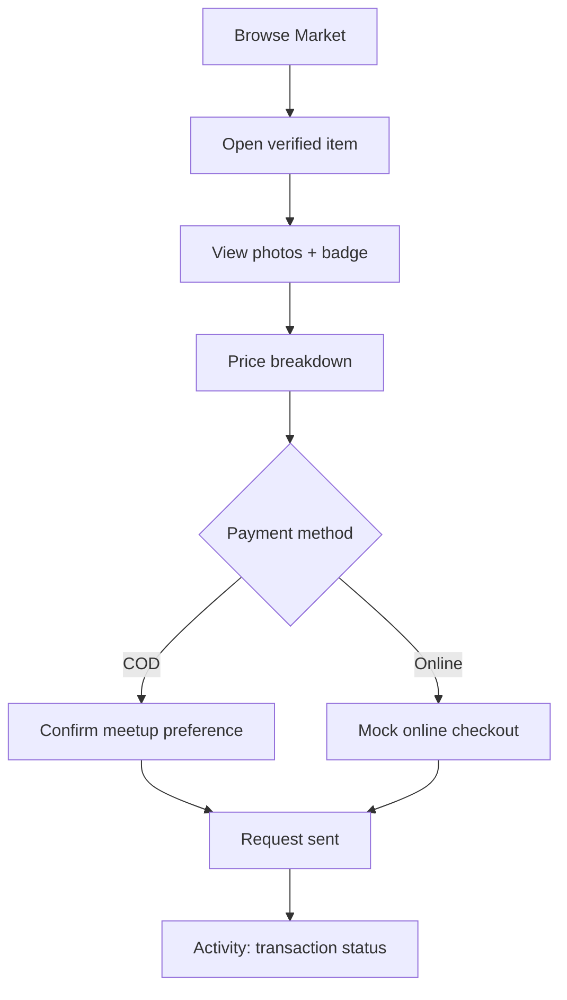
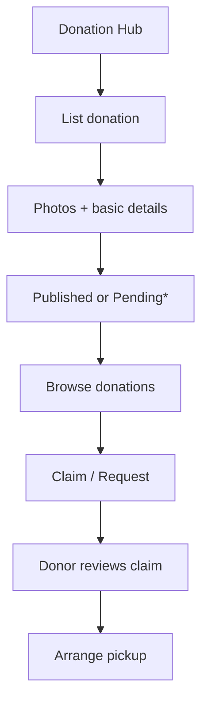
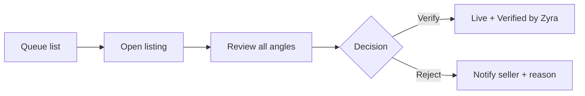

# User Flows

Flows are written for the usability-test prototype. Happy paths first; edge cases noted briefly.

---

## A. Sign up & location setup

**Steps**

1. User opens Zyra → Welcome  
2. Sign up: display name, email/username, password, age confirmation  
3. Prompt: “Where do you usually meet?” → city/area + optional named meetup pins (e.g. “Mall food court”, “Library steps”)  
4. Land on Home  

**Edge:** Skip meetup points → remind later from Profile / before first COD sale.

---

## B. Sell on marketplace (with verification)

**Photo angles (recommended fixed set for MVP)**

| Angle | Why |
| --- | --- |
| Front | Primary look |
| Back | Completeness |
| Tag / label | Brand/size authenticity |
| Close-up / defect | Trust on condition |

Allow “Add more” after the required set.

**Seller sees:** badge “Pending Verification — not visible to buyers yet.”

---

## C. Buy (COD or Online)

**Price breakdown (always shown before confirm)**

- Item price  
- Platform fee (if any; show even if ₱0 / $0 for research clarity)  
- **Total**  
- Short note: COD = pay at meetup; Online = pay now (simulated)

---

## D. Donate & claim

\*MVP choice: donations can skip photo verification **or** share the same queue (simpler trust story if same queue). Default proposal: **same pending queue** for consistency; light review for free items.

---

## E. Admin verification

Also: transactions board — filter by status (requested, completed, cancelled).

---

## F. Critical path for testing (scripted)

| # | Task | Primary persona |
| --- | --- | --- |
| 1 | Create account + set meetup point | Maya |
| 2 | List an item with 4 angles | Maya |
| 3 | As admin, verify the listing | Alex |
| 4 | As buyer, find item, choose COD, confirm | Jordan |
| 5 | List a donation + claim as another user | Sam / Org |

See [research/usability-plan.md](../research/usability-plan.md) for measures.
