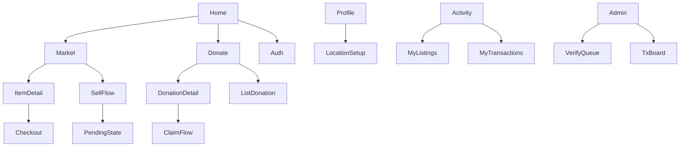

# Information Architecture

## Roles

| Role | Access |
| --- | --- |
| Guest | Browse public marketplace & donation teaser; prompted to sign up for actions |
| Teen user | Profile, sell, buy, donate, claim |
| Organization (optional flag) | Same as user + claim donations as org |
| Admin | Admin dashboard: verification queue, transactions, statuses |

## Primary navigation (mobile)

```text
[ Home ]  [ Market ]  [ Donate ]  [ Activity ]  [ Profile ]
```

| Tab | Contents |
| --- | --- |
| Home | Brand + short pitch + dual CTAs: Shop / Donate |
| Market | Browse/search marketplace listings (verified live) |
| Donate | Donation Hub browse + “List a donation” |
| Activity | My listings, requests, transactions |
| Profile | Account, location/meetup points, logout |

Admin is a separate route (`/admin`), not in teen tab bar.

## Screen inventory (MVP)

### Auth & profile

- Welcome / Home  
- Sign up  
- Log in  
- Profile view/edit  
- Location & meetup points setup  

### Marketplace

- Market browse (list/grid)  
- Item detail (photos, badge, price breakdown, payment options)  
- Sell flow: details → multi-angle photos → review → submitted (pending)  
- Checkout / request purchase (COD or Online)  
- Seller “my listing” status (Pending / Verified / Rejected / Sold)  

### Donation Hub

- Donation browse  
- Donation detail  
- List donation (photos + basic details)  
- Claim / request form  
- My donation listings & incoming claims  

### Admin

- Login (admin)  
- Verification queue (photo review)  
- Listing detail → Approve / Reject (+ note)  
- Transactions / status board  

## Content objects

```text
User
  └── Profile (display name, age band, location, meetupPoints[])

Listing (type: marketplace | donation)
  ├── photos[] (angle labels for marketplace)
  ├── status: draft | pending | verified | rejected | claimed | sold | closed
  ├── price? (marketplace only)
  └── sellerId

Transaction (marketplace)
  ├── listingId, buyerId, sellerId
  ├── paymentMethod: cod | online
  ├── amounts: item, fee, total
  └── status: requested | accepted | completed | cancelled

DonationClaim
  ├── listingId, claimerId
  ├── message, contact
  └── status: requested | approved | fulfilled | declined
```

## Hierarchy sketch


