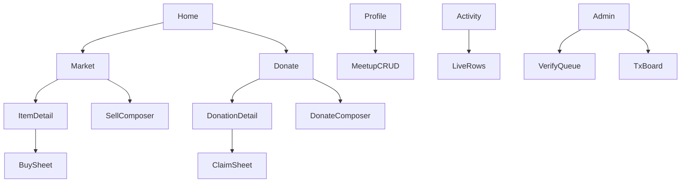

# Information Architecture

Low-friction IA: fewer routes, sheets for commit actions, live Supabase behind every surface.

## Roles

| Role | Access |
| --- | --- |
| Guest | Browse verified Market & Donate; auth Sheet on Sell / Buy / Claim |
| Teen user | Profile, sell, buy, donate, claim, Activity |
| Organization | Same as user + `is_organization` on profile / claim form |
| Admin | `/admin` queue + transactions (no teen tab bar) |

## Primary navigation (mobile)

```text
[ Home ]  [ Market ]  [ Donate ]  [ Activity ]  [ Profile ]
```

| Tab | Contents |
| --- | --- |
| Home | Brand hero + dual CTAs: Shop / Donate |
| Market | Verified listings + Sell CTA → composer |
| Donate | Hub browse + List donation → composer; **Centers** directory |
| Activity | Unified live inbox: listings, buys, claims |
| Profile | Account, meetups, **Customize page** (Tumblr-like), donor tier |

## Screen inventory (MVP)

### Core routes

- Home  
- Market browse / Market detail (+ **Buy Sheet**)  
- Sell composer (`/market/new`) — single screen  
- Donate browse / Donate detail (+ **Claim Sheet**)  
- Donate composer (`/donate/new`) — single screen  
- **Donation Centers** `/donate/centers`, `/donate/centers/[id]`  
- Activity (unified)  
- Profile (meetups + **Customize page** + donor tier)  
- Public profile `/profile/[id]` (themed)  
- Auth Sheet (signup/login; not a hard gate for browse)  

### Admin ERP routes (mobile + desktop)

- `/admin/dashboard` — ERP overview  
- `/admin` — Verification queue (inline Approve / Reject)  
- `/admin/transactions` — Money / payout ledger  
- `/admin/cms` — Homepage heroes & content  
- `/admin/experiments` — A/B experiments  
- `/admin/analytics` — Ops analytics  
- `/admin/settings` — Currency, fees, users, approvers  

All modules share `AdminShell` so phone operators can run the site. See [admin-erp.md](./admin-erp.md) and [mobile-desktop-parity.md](./mobile-desktop-parity.md).

### Removed vs earlier wizard IA

- Separate location-only onboarding page (folded into signup + Profile)  
- Multi-step sell routes (details → photos → review)  
- Standalone checkout page (replaced by Buy Sheet)  
- Separate “my listings” / “my transactions” teen pages (merged into Activity)  

## Content objects (live tables)

See [data-model.md](./data-model.md): `profiles`, `meetup_points`, `listings`, `listing_photos`, `transactions`, `donation_claims`, `audit_events`.

## Hierarchy


